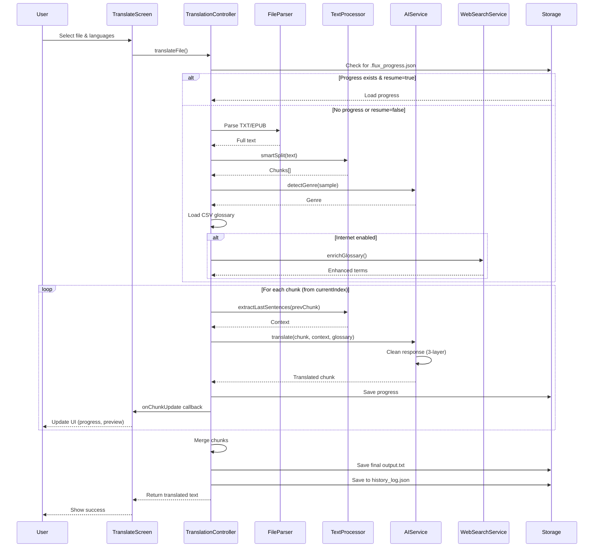

# FluxOrigin - System Architecture

## High-Level Architecture

FluxOrigin follows a **layered architecture** pattern with clear separation of concerns:

```
┌─────────────────────────────────────────────────────────────┐
│                      UI Layer (Flutter)                      │
│  ┌──────────┐  ┌──────────┐  ┌──────────┐  ┌──────────┐   │
│  │ Translate│  │ History  │  │Dictionary│  │ Settings │   │
│  │  Screen  │  │  Screen  │  │  Screen  │  │  Screen  │   │
│  └────┬─────┘  └────┬─────┘  └────┬─────┘  └────┬─────┘   │
└───────┼─────────────┼─────────────┼─────────────┼─────────┘
        │             │             │             │
┌───────┼─────────────┼─────────────┼─────────────┼─────────┐
│       │      State Management (Provider)         │         │
│  ┌────▼─────────┐                          ┌────▼─────┐   │
│  │ThemeNotifier │                          │  Config  │   │
│  │              │                          │ Provider │   │
│  └──────────────┘                          └──────────┘   │
└───────────────────────────────────────────────────────────┘
        │
┌───────▼────────────────────────────────────────────────────┐
│              Controller Layer (Business Logic)              │
│  ┌──────────────────────────────────────────────────────┐  │
│  │          TranslationController                       │  │
│  │  - Orchestrates translation pipeline                 │  │
│  │  - Manages progress persistence                      │  │
│  │  - Coordinates services                              │  │
│  └─────┬────────────────────────────────────────┬───────┘  │
└────────┼────────────────────────────────────────┼──────────┘
         │                                        │
┌────────▼────────────────────────────────────────▼──────────┐
│                   Service Layer                             │
│  ┌──────────┐  ┌──────────────┐  ┌────────────────────┐   │
│  │AIService │  │WebSearch     │  │  DevLogger         │   │
│  │          │  │Service       │  │                    │   │
│  └────┬─────┘  └──────┬───────┘  └────────────────────┘   │
└───────┼────────────────┼────────────────────────────────────┘
        │                │
┌───────▼────────────────▼────────────────────────────────────┐
│                 External Dependencies                        │
│  ┌──────────┐  ┌──────────────┐  ┌────────────────────┐   │
│  │ Ollama   │  │  LM Studio   │  │  Web Search API    │   │
│  │localhost │  │  localhost   │  │  (Optional)        │   │
│  │  :11434  │  │    :1234     │  │                    │   │
│  └──────────┘  └──────────────┘  └────────────────────┘   │
└─────────────────────────────────────────────────────────────┘

┌─────────────────────────────────────────────────────────────┐
│                    Utility Layer                             │
│  ┌──────────────┐  ┌──────────────┐  ┌──────────────┐      │
│  │TextProcessor │  │ FileParser   │  │  AppStrings  │      │
│  │              │  │              │  │    (i18n)    │      │
│  └──────────────┘  └──────────────┘  └──────────────┘      │
└─────────────────────────────────────────────────────────────┘

┌─────────────────────────────────────────────────────────────┐
│                      Data Layer                              │
│  ┌────────────────────────────────────────────────────────┐ │
│  │  Local File System                                     │ │
│  │  - .flux_progress.json (resume state)                 │ │
│  │  - history_log.json (translation history)             │ │
│  │  - *.csv (glossary files)                             │ │
│  │  - Output TXT files                                   │ │
│  └────────────────────────────────────────────────────────┘ │
└─────────────────────────────────────────────────────────────┘
```

## Component Interactions

### Translation Flow Diagram



## Core Components

### 1. Translation Controller
**File:** `lib/controllers/translation_controller.dart`

**Responsibilities:**
- Orchestrates the entire translation pipeline
- Manages file parsing and chunking
- Coordinates AI service calls
- Implements resume logic with progress persistence
- Handles pause/resume user requests

**Key Methods:**
```dart
Future<String?> translateFile({
  required String filePath,
  required String sourceLang,
  required String targetLang,
  required String dictionaryDir,
  Function(String, double)? onUpdate,
  Function(int, int, String, String)? onChunkUpdate,
  bool allowInternet = true,
  bool resume = false,
})

Future<bool> hasProgress(String filePath, String dictionaryDir)
Future<double?> getProgressPercentage(String filePath, String dictionaryDir)
Future<void> deleteProgress(String filePath, String dictionaryDir)
void requestPause()
void resetPause()
```

**State Management:**
- Pause flag (`_isPaused`)
- Progress model (`TranslationProgress`)
- Temporary context storage (last 200 chars)

### 2. AI Service
**File:** `lib/services/ai_service.dart`

**Responsibilities:**
- Abstract dual-provider API (Ollama + LM Studio)
- Execute translation, genre detection, and glossary generation
- Implement anti-hallucination 3-layer defense
- Health check and connection validation

**Provider Abstraction:**
```dart
enum AIProviderType { ollama, lmStudio }

// Ollama endpoints
POST http://localhost:11434/api/chat
GET  http://localhost:11434/api/tags
POST http://localhost:11434/api/pull

// LM Studio endpoints
POST http://localhost:1234/v1/chat/completions
GET  http://localhost:1234/v1/models
```

**Anti-Hallucination System:**
1. **Model Parameters:**
   ```dart
   {
     "temperature": 0.3,    // Low creativity for accuracy
     "top_p": 0.9,          // Nucleus sampling
     "repeat_penalty": 1.1  // Discourage repetition
   }
   ```

2. **Response Cleaning:**
   ```dart
   String _cleanResponse(String text) {
     // Remove markdown code blocks
     text = text.replaceAll(RegExp(r'```[\s\S]*?```'), '');
     // Remove meta-commentary patterns
     text = text.replaceAll(RegExp(r'\[.*?\]|\(.*?\)'), '');
     // Trim whitespace
     return text.trim();
   }
   ```

3. **Garbage Detection:**
   ```dart
   bool _isGarbageResponse(String text) {
     // Check for excessive repetition
     if (hasRepeatingPatterns(text, threshold: 3)) return true;
     // Check for non-text artifacts
     if (hasExcessiveSymbols(text, ratio: 0.2)) return true;
     return false;
   }
   ```

### 3. Text Processor
**File:** `lib/utils/text_processor.dart`

**Responsibilities:**
- Smart chunking with sentence boundary detection
- Context extraction for continuity
- Sample generation for genre detection

**Chunking Algorithm:**
```dart
static List<String> smartSplit(String text, {int targetSize = 1000}) {
  // Target: 1000 chars, Max: 1500 chars
  // 1. Look backward from target to find sentence terminator
  // 2. If not found, look forward up to max
  // 3. Never split mid-sentence (preserves context)
}
```

**Context Extraction:**
```dart
static String extractLastSentences(String text, {int maxLength = 200}) {
  // Extract last 1-2 sentences (up to 200 chars)
  // Used to maintain narrative flow between chunks
}
```

### 4. File Parser
**File:** `lib/utils/file_parser.dart`

**Responsibilities:**
- Parse TXT files (UTF-8 encoding)
- Parse EPUB files (extract text from XHTML)
- Normalize whitespace and line breaks

**Supported Formats:**
- `.txt` - Plain text
- `.epub` - Electronic publication (via `epubx` package)

### 5. Web Search Service
**File:** `lib/services/web_search_service.dart`

**Responsibilities:**
- RAG (Retrieval-Augmented Generation) for glossary enrichment
- Search web for genre-specific terms
- Enhance translation quality with contextual definitions

**Optional Feature:** Requires internet, disabled by default

### 6. State Management

#### Theme Notifier
**File:** `lib/ui/theme/app_theme.dart`

```dart
class ThemeNotifier extends ChangeNotifier {
  ThemeMode _themeMode = ThemeMode.system;

  ThemeMode get themeMode => _themeMode;

  void setThemeMode(ThemeMode mode) {
    _themeMode = mode;
    notifyListeners();
    // Persists to SharedPreferences
  }
}
```

#### Config Provider
**File:** `lib/ui/theme/config_provider.dart`

```dart
class ConfigProvider extends ChangeNotifier {
  String _aiUrl = 'http://localhost:11434';
  AIProviderType _providerType = AIProviderType.ollama;
  String _language = 'vi';

  // Getters, setters with notifyListeners()
  // Persistence via SharedPreferences
}
```

## Data Flow

### Translation Pipeline Steps

1. **File Upload**
   - User selects TXT/EPUB file via `FileUploadZone`
   - File validated (extension, size, existence)

2. **Parse & Chunk**
   - `FileParser` extracts text
   - `TextProcessor.smartSplit()` creates chunks (1000-1500 chars)

3. **Genre Detection**
   - `AIService.detectGenre()` analyzes sample text (head + mid + tail)
   - Returns: KIEMHIEP, NGONTINH, KINHDOANH, KHAC

4. **Glossary Loading**
   - Load `{genre}.csv` from dictionary directory
   - Optional: `WebSearchService.enrichGlossary()` for additional terms

5. **Chunk Translation Loop**
   ```
   For each chunk i from currentIndex to total:
     a. Extract context from chunk[i-1] (last 200 chars)
     b. Build prompt: context + chunk[i] + glossary
     c. Call AIService.translate()
     d. Clean response (3-layer anti-hallucination)
     e. Save progress to .flux_progress.json
     f. Invoke onChunkUpdate callback (live preview)
     g. Check pause flag, break if paused
   ```

6. **Finalization**
   - Merge all translated chunks
   - Save to `{filename}_translated.txt`
   - Append to `history_log.json`
   - Delete `.flux_progress.json` (cleanup)

### Resume Mechanism

**Progress File Format:**
```json
{
  "fileName": "example.txt",
  "sourceLang": "en",
  "targetLang": "vi",
  "rawChunks": ["chunk1", "chunk2", "..."],
  "translatedChunks": ["translated1", "translated2"],
  "currentIndex": 2,
  "genreDetected": "KIEMHIEP",
  "glossary": {"term1": "translation1"}
}
```

**Resume Logic:**
1. Check if `.flux_progress.json` exists
2. If yes and `resume=true`, load state
3. Skip chunks 0 to `currentIndex-1` (already translated)
4. Continue from `currentIndex`

## Storage Architecture

### File System Structure
```
Project Directory/
├── dictionaries/
│   ├── KIEMHIEP.csv        # Martial arts glossary
│   ├── NGONTINH.csv        # Romance glossary
│   ├── KINHDOANH.csv       # Business glossary
│   └── KHAC.csv            # General glossary
│
├── translations/
│   ├── book1_translated.txt
│   ├── book1.flux_progress.json   # Resume file (deleted on completion)
│   ├── book2_translated.txt
│   └── history_log.json           # All translation records
│
└── logs/
    └── dev_logs.txt               # Debug logs
```

### Persistence Layer

**SharedPreferences (Config):**
- AI provider URL
- Provider type (Ollama/LM Studio)
- Theme mode (light/dark/system)
- UI language (vi/en)
- Dictionary directory path

**JSON Files:**
- `history_log.json` - Array of translation metadata
- `.flux_progress.json` - Single translation state snapshot

## UI Architecture

### Navigation Structure
```
IndexedStack (main.dart)
├─ 0: TranslateScreen
├─ 1: HistoryScreen
├─ 2: DictionaryScreen
├─ 3: SettingsScreen
└─ 4: DevLogsScreen
```

**Sidebar Navigation:**
- Click sidebar item → `setState()` changes stack index
- No routes, single-page app model

### Custom Title Bar
**File:** `lib/ui/widgets/title_bar.dart`

- Height: 32px
- Custom window controls (minimize, maximize, close)
- Drag-to-move functionality
- Hides native Windows title bar

### Theme System
**Light Theme:**
- Background: `#FFFFFF`
- Primary: `#2196F3`
- Text: `#000000`

**Dark Theme:**
- Background: `#121212`
- Primary: `#BB86FC`
- Text: `#FFFFFF`

## AI Integration Details

### Prompt Engineering

**Translation Prompt Template:**
```
You are a professional translator specializing in {genre}.

CONTEXT FROM PREVIOUS SECTION:
{last_200_chars}

GLOSSARY TERMS:
{csv_glossary_entries}

SOURCE TEXT ({source_lang}):
{current_chunk}

Translate the SOURCE TEXT to {target_lang}. Follow these rules:
1. Preserve the original tone and style
2. Use glossary terms when applicable
3. Maintain narrative continuity with the context
4. Output ONLY the translation, no explanations
```

**Genre Detection Prompt:**
```
Analyze this text sample and classify its genre:
- KIEMHIEP: Martial arts, wuxia, action
- NGONTINH: Romance, relationships, emotions
- KINHDOANH: Business, economics, finance
- KHAC: Other (general fiction, non-fiction)

TEXT SAMPLE:
{head_mid_tail_sample}

Respond with ONLY the genre code (KIEMHIEP/NGONTINH/KINHDOANH/KHAC).
```

### Model Recommendations
- **Ollama:** `llama3.1:8b`, `gemma2:9b`, `qwen2.5:14b`
- **LM Studio:** Any LLaMA 3.1, Mistral, or Qwen model
- **Minimum VRAM:** 8GB for 8B models, 16GB for 14B models

## Security Considerations

### Data Privacy
- **No telemetry**: Zero analytics or tracking
- **Local processing**: All data stays on device
- **No cloud sync**: No external servers contacted (except optional web search)

### Input Validation
- File extension whitelist (`.txt`, `.epub`)
- File size limits (implied by chunk processing)
- Path sanitization for output files

### Error Boundaries
- Try-catch blocks around all async operations
- Graceful degradation (e.g., disable web search if offline)
- User-friendly error messages (no stack traces shown)

## Performance Characteristics

### Time Complexity
- **Chunking:** O(n) where n = text length
- **Translation:** O(m) where m = number of chunks (serial processing)
- **Progress save:** O(1) per chunk (atomic write)

### Space Complexity
- **Memory:** O(n) for full text + O(m) for all chunks
- **Disk:** ~1.5KB per chunk for progress file

### Bottlenecks
1. **AI inference speed** (dominant factor, typically 1-3 chunks/min)
2. File I/O for large EPUB files
3. Web search latency (if enabled)

## Scalability Limits

**Current Design:**
- Max file size: ~10MB (limited by memory for chunk array)
- Max chunks: ~10,000 (typical book: 100-500 chunks)
- Concurrent translations: 1 (single-threaded pipeline)

**Future Enhancements:**
- Streaming parser for larger files
- Parallel chunk translation (with dependency management)
- Batch mode for multiple files

---

**Document Version:** 1.0
**Last Updated:** 2026-01-04
**Architecture Status:** Stable (v2.0.2)
